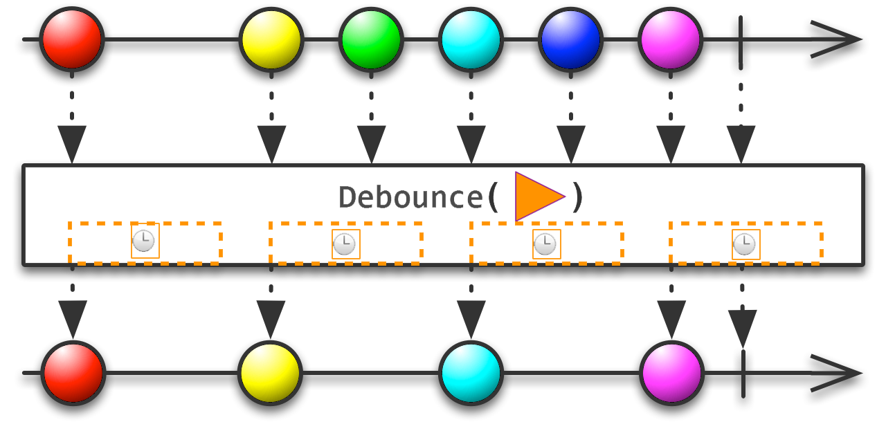

# DebounceMonitoring

[](https://github.com/SIDOVSKY/DebounceMonitoring/actions/workflows/ci.yml)
[](#DebounceMonitoring)
[](https://www.nuget.org/packages/DebounceMonitoring/)

Extensions to filter out repeated function calls caused by false or accidental clicks or touches.
* One-line integration
* Inlined, no method wrapping
* Shareable between multiple platforms
* Automated testing friendly

## Installing

Add [NuGet package](https://www.nuget.org/packages/DebounceMonitoring) to your [.NET Standard 2.0 - compatible](https://github.com/dotnet/standard/blob/master/docs/versions/netstandard2.0.md#platform-support) project

```
PM> Install-Package DebounceMonitoring
```

## Usage

```csharp
using DebounceMonitoring;
```

#### Debounce **instance** methods:
```csharp
internal class ViewModel
{
    public void OnButtonClick()
    {
        if (this.DebounceHere()) return;

        // Handle the click
    }
}
```
<sup>[snippet source](/DebounceMonitoring.Tests/Snippets/Sample.cs#L9-L16)</sup>

#### Debounce **lambdas** and **local functions**:
```csharp
public Command ClickCommand { get; }

public ViewModel()
{
    ClickCommand = new Command(() =>
    {
        if (this.DebounceHere()) return;

        // Handle the click
    });
}
```
<sup>[snippet source](/DebounceMonitoring.Tests/Snippets/Sample.cs#L18-L28)</sup>

#### Debounce **static** methods:
```csharp
internal class Analytics
{
    public static void TrackEvent()
    {
        if (DebounceMonitor.DebounceHereStatic<Analytics>()) return;

        // Send the event
    }
}
```
<sup>[snippet source](/DebounceMonitoring.Tests/Snippets/Sample.cs#L52-L61)</sup>

### Rx Operator

This library also provides the simplest implementation of the debounce operator for [Rx.NET](https://github.com/dotnet/reactive) ([`throttle`](https://rxmarbles.com/#throttle) in RxJs).



Example:
```csharp
button.ClickAsObservable()
    .Debounce()
    .Subscribe(_ => OnButtonClick());
```
<sup>[snippet source](/DebounceMonitoring.Tests/Snippets/Sample.cs#L32-L34)</sup>

### Interval

The default debounce interval is 500 ms.  
It can be specified as an argument:

```csharp
this.DebounceHere(intervalMs: 1_000)

IObservable<T>.Debounce(intervalMs: 1_000)
```
or set globally:

```csharp
DebounceMonitor.DefaultInterval = TimeSpan.FromSeconds(5);
```

### Disable (for automated testing)

The `DebounceMonitor` can be disabled in your base `TestFixture.Setup` or globally in `ModuleInitializer` with [ModuleInitializerAttribute](https://docs.microsoft.com/dotnet/api/system.runtime.compilerservices.moduleinitializerattribute) or [Fody.ModuleInit](https://github.com/Fody/ModuleInit).

```csharp
internal static class UnitTestGlobalSetup
{
    [System.Runtime.CompilerServices.ModuleInitializer]
    internal static void SetupDebounceMonitor() => DebounceMonitor.Disabled = true;
}
```
<sup>[snippet source](/DebounceMonitoring.Tests/Snippets/Sample.cs#L63-L67)</sup>

## How does it work?

When `this.DebounceHere` is called, the call time is mapped to its location (method name + line number) and target (`this` in this case).

On the next call, the time is compared to the stored one. If the `interval` has not yet passed, then the call is meant to be debounced.

The debounce target (reference) is held weakly, so no memory leaks are caused.

## License

This project is licensed under the MIT license - see the [LICENSE](LICENSE) file for details.